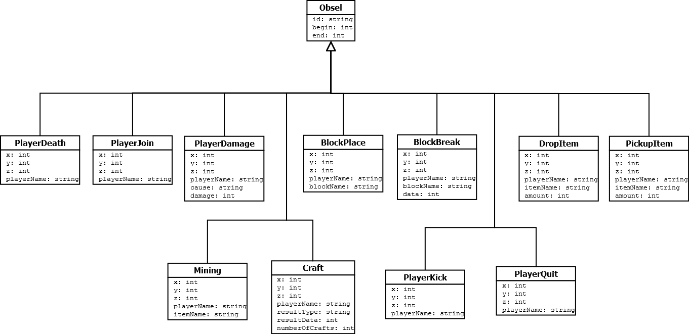

# Rapport Minetrace
Par [Bastien Guyl](http://bastien.guyl.me) et [Marc Zominy](https://github.com/zominym)

### Sommaire
* [Présentation du projet](#markdown-header-présentation-du-projet)
* [Transformation des données](#markdown-header-transformation-des-données)
* [Mise en place de la structure dans kTBS](#markdown-header-mise-en-place-de-la-structure-dans-ktbs)
* [Mise en place des transformations](#markdown-header-mise-en-place-des-transformations)
* [Visualisation des données](#markdown-header-visualisation-des-données)
* [Analyse des données](#markdown-header-analyse-des-données)
* [Conclusion](#markdown-header-conclusion)

### Présentation du projet <a name="markdown-header-présentation-du-projet"></a>
Ceci est le rapport d'un [projet](http://liris.cnrs.fr/~pchampin/2016/m2ia-knodyn/project.html) de cours de *Dynamique des connaissances* en Master 2 en Intelligence Artificielle de l'Université Claude Bernard Lyon 1.

Le but est d'étudier des données provenant du jeu [Minecraft](http://minecraft.net) générées par le plugin [Minetrace](https://github.com/Lyon1-Asterix/Minetrace).
Nous traitons ensuite les données avec le script NodeJs **transform.js** disponible ci-joint et nous les insérons dans la plateforme [kTBS](https://liris-ktbs01.insa-lyon.fr:8000/public/) de l'université.

Notre base se situe à l'adresse suivante : [liris-ktbs01.insa-lyon.fr:8000/public/master-ia-2016/zguyl/](https://liris-ktbs01.insa-lyon.fr:8000/public/master-ia-2016/zguyl/)

### Mise en place de la structure dans kTBS <a name="markdown-header-mise-en-place-de-la-structure-dans-ktbs"></a>
Les données mises à notre disposition sont propice à être hierarchisées. Cependant, étant donné leur faible diversité, cela nous a conduit à établir une structure plate, plus facile et rapide à utiliser.
Cependant, un exemple de structure hierarchisée est disponible [ici](https://github.com/MrVil/OWL-Minetrace)
Etant donné qu'on ne souhaite pas s'intéresser aux craft, on ne récupère que les informations de base de cette action.

Voici le schéma de la structure produite :


Et les requêtes envoyées au serveur kTBS :
##### Création de la base
`POST:https://liris-ktbs01.insa-lyon.fr:8000/public/master-ia-2016/`
```json
{
    "@id": "zguyl/",
    "@type": "Base"
}
```

##### Création de la trace
```json
{
    "@id": "t01/",
    "@type": "StoredTrace",
    "hasModel": "http://liris.cnrs.fr/silex/2011/simple-trace-model",
    "origin": "1970-01-01T00:00:00Z"
}
```

### Transformation des données <a name="markdown-header-transformation-des-données"></a>
Pour la transformation des données, deux versions du script

### Mise en place des transformations <a name="markdown-header-mise-en-place-des-transformations"></a>
TODO

### Visualisation des données <a name="markdown-header-visualisation-des-données"></a>
TODO

### Analyse des données <a name="markdown-header-analyse-des-données"></a>
TODO

### Conclusion <a name="markdown-header-conclusion"></a>
TODO
