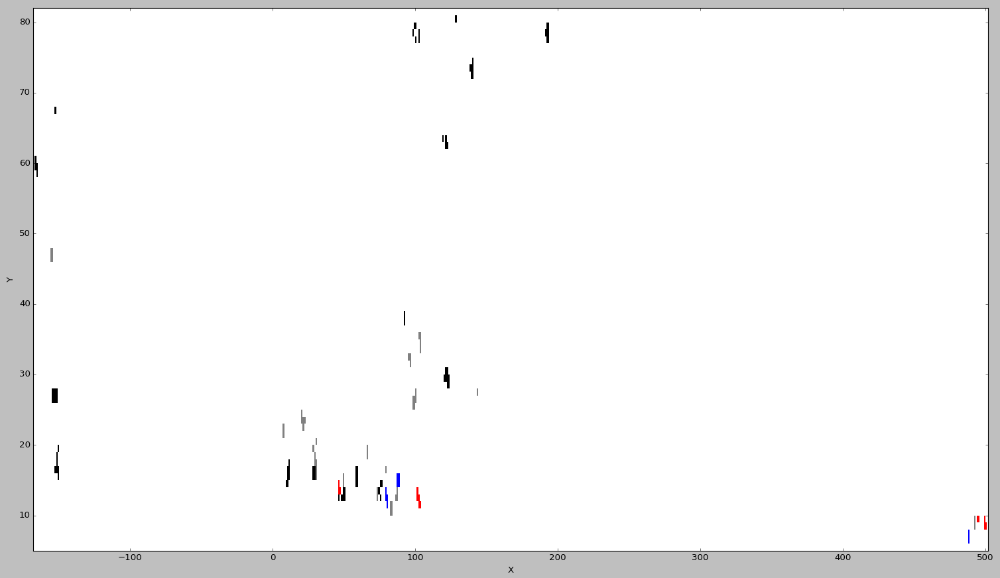

# Rapport Minetrace
Par [Bastien Guyl](http://bastien.guyl.me) et [Marc Zominy](https://github.com/zominym)

### Sommaire
* [Présentation du projet](#markdown-header-présentation-du-projet)
* [Transformation des données](#markdown-header-transformation-des-données)
* [Mise en place de la structure dans kTBS](#markdown-header-mise-en-place-de-la-structure-dans-ktbs)
* [Mise en place des transformations](#markdown-header-mise-en-place-des-transformations)
* [Visualisation des données](#markdown-header-visualisation-des-données)
* [Analyse des données](#markdown-header-analyse-des-données)

### Présentation du projet <a name="markdown-header-présentation-du-projet"></a>
Ceci est le rapport d'un [projet](http://liris.cnrs.fr/~pchampin/2016/m2ia-knodyn/project.html) de cours de *Dynamique des connaissances* en Master 2 en Intelligence Artificielle de l'Université Claude Bernard Lyon 1.

Le but est d'étudier des données provenant du jeu [Minecraft](http://minecraft.net) générées par le plugin [Minetrace](https://github.com/Lyon1-Asterix/Minetrace).
Nous traitons ensuite les données avec le script NodeJs **transform.js** disponible ci-joint et nous les insérons dans la plateforme [kTBS](https://liris-ktbs01.insa-lyon.fr:8000/public/) de l'université.

Notre base se situe à l'adresse suivante : [liris-ktbs01.insa-lyon.fr:8000/public/master-ia-2016/zguyl/](https://liris-ktbs01.insa-lyon.fr:8000/public/master-ia-2016/zguyl/)

### Mise en place de la structure dans kTBS <a name="markdown-header-mise-en-place-de-la-structure-dans-ktbs"></a>
Les données mises à notre disposition sont propice à être hierarchisées. Cependant, étant donné leur faible diversité, cela nous a conduit à établir une structure plate, plus facile et rapide à utiliser.

Cependant, un exemple de structure hierarchisée est disponible [ici](https://github.com/MrVil/OWL-Minetrace)

Etant donné qu'on ne souhaite pas s'intéresser aux craft, on ne récupère que les informations de base de cette action.

Voici le schéma de la structure produite :


Et les requêtes envoyées au serveur kTBS :
##### Création de la base
`POST:https://liris-ktbs01.insa-lyon.fr:8000/public/master-ia-2016/`
```json
{
    "@id": "zguyl/",
    "@type": "Base"
}
```

##### Création du model
`POST:https://liris-ktbs01.insa-lyon.fr:8000/public/master-ia-2016/zguyl/`
```json
{
    "@id": "model1",
    "@type": "TraceModel"
}
```
`PUT:https://liris-ktbs01.insa-lyon.fr:8000/public/master-ia-2016/zguyl/model1`
```json
{
    "@id": "#PlayerKick",
    "@type": "ObselType"
}, {
    "@id": "#PlayerDamage",
    "@type": "ObselType"
}, {
    "@id": "#PickupItem",
    "@type": "ObselType"
}, {
    "@id": "#DropItem",
    "@type": "ObselType"
}, {
    "@id": "#PlayerDeath",
    "@type": "ObselType"
}, {
    "@id": "#BlockBreak",
    "@type": "ObselType"
}, {
    "@id": "#PlayerQuit",
    "@type": "ObselType"
}, {
    "@id": "#Craft",
    "@type": "ObselType"
}, {
    "@id": "#BlockPlace",
    "@type": "ObselType"
}, {
    "@id": "#PlayerJoin",
    "@type": "ObselType"
}, {
    "@id": "#Mining",
    "@type": "ObselType"
}, {
    "@id": "#x",
    "@type": "AttributeType",
    "hasAttributeObselType": ["#PlayerKick", "#PlayerDamage", "#PickupItem", "#DropItem", "#PlayerDeath", "#BlockBreak", "#PlayerQuit", "#Craft", "#BlockPlace", "#PlayerJoin", "#Mining"],
    "hasAttributeDatatype": ["xsd:integer"],
    "label": "x"
}, {
    "@id": "#z",
    "@type": "AttributeType",
    "hasAttributeObselType": ["#PlayerKick", "#PlayerDamage", "#PickupItem", "#DropItem", "#PlayerDeath", "#BlockBreak", "#PlayerQuit", "#Craft", "#BlockPlace", "#PlayerJoin", "#Mining"],
    "hasAttributeDatatype": ["xsd:integer"],
    "label": "z"
}, {
    "@id": "#y",
    "@type": "AttributeType",
    "hasAttributeObselType": ["#PlayerKick", "#PlayerDamage", "#PickupItem", "#DropItem", "#PlayerDeath", "#BlockBreak", "#PlayerQuit", "#Craft", "#BlockPlace", "#PlayerJoin", "#Mining"],
    "hasAttributeDatatype": ["xsd:integer"],
    "label": "y"
}, {
    "@id": "#playerName",
    "@type": "AttributeType",
    "hasAttributeObselType": ["#PlayerKick", "#PlayerDamage", "#PickupItem", "#DropItem", "#PlayerDeath", "#BlockBreak", "#PlayerQuit", "#Craft", "#BlockPlace", "#PlayerJoin", "#Mining"],
    "hasAttributeDatatype": ["xsd:string"],
    "label": "Player name"
}, {
    "@id": "#data",
    "@type": "AttributeType",
    "hasAttributeObselType": ["#PickupItem", "#DropItem", "#BlockBreak", "#BlockPlace"],
    "hasAttributeDatatype": ["xsd:integer"],
    "label": "data"
}, {
    "@id": "#blockName",
    "@type": "AttributeType",
    "hasAttributeObselType": ["#BlockBreak", "#BlockPlace"],
    "hasAttributeDatatype": ["xsd:string"],
    "label": "Block name"
}, {
    "@id": "#itemName",
    "@type": "AttributeType",
    "hasAttributeObselType": ["#PickupItem", "#DropItem", "#Mining"],
    "hasAttributeDatatype": ["xsd:string"],
    "label": "Item name"
}, {
    "@id": "#amount",
    "@type": "AttributeType",
    "hasAttributeObselType": ["#PickupItem", "#DropItem"],
    "hasAttributeDatatype": ["xsd:integer"],
    "label": "Amount"
}, {
    "@id": "#damage",
    "@type": "AttributeType",
    "hasAttributeObselType": ["#PlayerDamage"],
    "hasAttributeDatatype": ["xsd:integer"],
    "label": "damage"
}, {
    "@id": "#cause",
    "@type": "AttributeType",
    "hasAttributeObselType": ["#PlayerDamage"],
    "hasAttributeDatatype": ["xsd:string"],
    "label": "cause"
}, {
    "@id": "#resultBCraft",
    "@type": "AttributeType",
    "hasAttributeObselType": ["#Craft"],
    "hasAttributeDatatype": ["xsd:integer"],
    "label": "Result B Craft"
}, {
    "@id": "#numberOfCrafts",
    "@type": "AttributeType",
    "hasAttributeObselType": ["#Craft"],
    "hasAttributeDatatype": ["xsd:integer"],
    "label": "Number of craft"
}, {
    "@id": "#resultData",
    "@type": "AttributeType",
    "hasAttributeObselType": ["#Craft"],
    "hasAttributeDatatype": ["xsd:integer"],
    "label": "Result data"
}, {
    "@id": "#resultType",
    "@type": "AttributeType",
    "hasAttributeObselType": ["#Craft"],
    "hasAttributeDatatype": ["xsd:string"],
    "label": "Result type"
}
```

##### Création de la trace
`POST:https://liris-ktbs01.insa-lyon.fr:8000/public/master-ia-2016/zguyl/`
```json
{
    "@id": "t01/",
    "@type": "StoredTrace",
    "hasModel": "model1/"
}
```

### Transformation des données <a name="markdown-header-transformation-des-données"></a>
Pour la transformation des données, deux versions du script sont disponible. `transformation.js` pour les données fournies dans l'énoncé du projet, et `transformation2.js` pour les données que nous avons crées par nous même.

Voici comment utiliser le script
* `npm i` : installe les dépendances
* `node transform.js input.json` : transforme les données de *input.json* en obsels dans le fichier *output.json*
* `node transform.js input.json -o foo.json` : le paramètre *-o* permet de spécifier une sortie
* `node transform.js input.json -api http://example.com` : le paramètre *-api* permet de spécifier la destination du *json* en `HTTP:POST`

### Mise en place des transformations <a name="markdown-header-mise-en-place-des-transformations"></a>
Nous avons choisi d'analyser le minage des ressources précieuses du jeu.

Voici l'automate utilisé pour créer une couche d'abstraction supplémentaire concernant le minagedes ressources :


Et voici sa description en JSON pour l'utilisation de FSA4stream :

```json
{
    "allow_overlap": true,
    "states": {
        "start": {
            "transitions": [{
                "condition": "#BlockBreak",
                "target": "check_pickup"
            }]
        },
        "check_pickup": {
            "transitions": [{
                "condition": "?obs a m:PickupItem . ?obs m:itemName ?s1 . ?pred m:blockName ?s2 . ?s ?p ?o .FILTER regex(str(?s2), str(?s1)) .",
                "matcher": "sparql-ask",
                "target": "success"
            }]
        },
        "success": {
            "terminal": true,
            "ktbs_obsel_type": "#Mining",
            "ktbs_attributes": {
                "#x": "first #x",
                "#y": "first #y",
                "#z": "first #z",
                "#playerName": "first #playerName",
                "#itemName": "last #itemName"
            }
        }
    }
}
```
**La commande à envoyer pour un FSA** :

``` json
{
    "@id": "fsaDatcu4/",
    "@type": "ComputedTrace",
    "hasMethod": "fsa",
    "hasSource": [ "filteredDatcu/" ],
    "parameter": [ "model=model1", "origin=filteredDatcu/", "fsa={\"allow_overlap\":true,\"states\":{\"start\":{\"transitions\":[{\"condition\":\"#BlockBreak\",\"target\":\"check_pickup\"}]},\"check_pickup\":{\"transitions\":[{\"condition\":\"?obs a m:PickupItem . ?obs m:itemName ?s1 . ?pred m:blockName ?s2 . ?s ?p ?o .FILTER regex(str(?s2), str(?s1)) .\",\"matcher\":\"sparql-ask\",\"target\":\"success\"}]},\"success\":{\"terminal\":true,\"ktbs_obsel_type\":\"#Mining\",\"ktbs_attributes\":{\"#x\":\"first #x\",\"#y\":\"first #y\",\"#z\":\"first #z\",\"#playerName\":\"first #playerName\",\"#itemName\":\"last #itemName\"}}}}" ]
}
```

**Filtrer par le pseudo du joueur** :

```json
{
    "@id": "filteredDatcu/",
    "@type": "ComputedTrace",
    "hasMethod": "filter",
    "hasSource": [ "t02/" ],
    "parameter": [ 
        "bgp=?obs m:playerName \"Datcu\""
    ]
}
```

**Fusion**
```json
{
    "@id": "fusionedMarc1/",
    "@type": "ComputedTrace",
    "hasMethod": "fusion",
    "hasSource": [ "fsaTardi/", "fsaDatcu4/" ],
    "parameter": [ "model=model1", "origin=fsaTardi/" ]
}
```

### Visualisation des données <a name="markdown-header-visualisation-des-données"></a>
Pour visualiser les données, des scripts python sont disponibles dans le répertoire [output_script](https://github.com/MrVil/rapport-minetrace/tree/master/output_script/).

Pour le lancer, il est nécessaire d'installer [Python3.5.X](https://www.python.org/), [Numpy](http://www.numpy.org/) et [Matplotlib](http://matplotlib.org/).

`python script.py nom_du_fichier_obsels.json`



Nous avons en axis, la position en X et en ordonné la position en Y (profondeur) du bloc miné. 
La couleur correspond au type du bloc.

`python script3d.py nom_du_fichier_obsels.json`


### Analyse des données <a name="markdown-header-analyse-des-données"></a>
A partir des graphiques précedents, nous pouvons déduire plusieurs informations :
* Le charbon, en noir, est présent à tous les niveaux.
* Le fer, en gris, n'est présent en quantité qu'à partir de la couche 40 enriron.
* La redstone et le diamant, respectivement rouge et bleu, ne sont disponibles que dans les couches basses.
* Entre les couches 40 et 60, les joueurs minent peu. On peut supposer que ce sont des zone peu profitables, difficiles d'accès pour peu de ressources.
